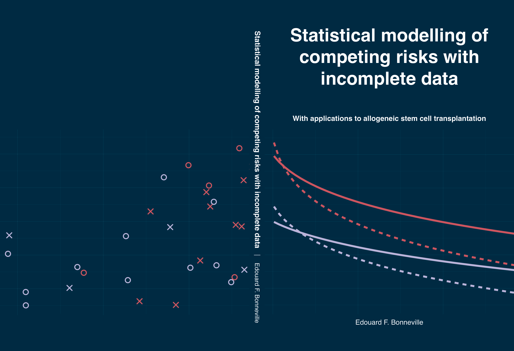

# PhD thesis: Statistical modelling of competing risks with incomplete data

This repository contains the sources files for my PhD thesis at Leiden University (defended on July 2nd, 2025), which was made using [Quarto](https://quarto.org/docs/books/) and [koma-script](https://ctan.org/pkg/koma-script). The pdf of the thesis is freely available at Leiden University Scholarly Publications ([online repository](https://scholarlypublications.universiteitleiden.nl/handle/1887/4252266)).

If you want to directly access the individual chapters (all were/are going to be published open access) + associated code, you can use the Table below:

| Chapter                                                      | Journal                                                      | DOI                                                          | Code repository                                              |
| ------------------------------------------------------------ | ------------------------------------------------------------ | ------------------------------------------------------------ | ------------------------------------------------------------ |
| Handling missing covariate data in clinical studies in haematology (Chapter 2) | *Best Practice & Research Clinical Haematology*              | [10.1016/j.beha.2023.101477](https://doi.org/10.1016/j.beha.2023.101477) | [https://github.com/survival-lumc/ReviewHaemaMissing](https://github.com/survival-lumc/ReviewHaemaMissing) |
| Multiple imputation for cause-specific Cox models: Assessing methods for estimation and prediction (Chapter 3) | *Statistical Methods in Medical Research*                    | [10.1177/09622802221102623](https://doi.org/10.1177/09622802221102623) | [https://github.com/survival-lumc/CauseSpecCovarMI](https://github.com/survival-lumc/CauseSpecCovarMI) |
| Impact of comorbidities and body mass index on the outcomes of allogeneic hematopoietic cell transplantation in myelofibrosis: A study on behalf of the Chronic Malignancies Working Party of EBMT (Chapter 4) | *American Journal of Hematology*                             | [10.1002/ajh.27262](https://doi.org/10.1002/ajh.27262)       | Not publicly available :(                                    |
| Multiple imputation of missing covariates when using the Fine–Gray model (Chapter 5) | *Statistics in Medicine*                                     | [10.1002/sim.70166](https://doi.org/10.1002/sim.70166) (to appear, for now use [preprint](https://arxiv.org/abs/2405.16602)) | [https://github.com/survival-lumc/FineGrayCovarMI](https://github.com/survival-lumc/FineGrayCovarMI) |
| Why you should avoid using multiple Fine–Gray models: insights from (attempts at) simulating proportional subdistribution hazards data (Chapter 6) | *Journal of the Royal Statistical Society, Series A (Statistics in Society)* | [10.1093/jrsssa/qnae056](https://doi.org/10.1093/jrsssa/qnae056) | [https://github.com/survival-lumc/FineGrayDGM](https://github.com/survival-lumc/FineGrayDGM) |
| Joint models quantify associations between immune cell kinetics and allo-immunological events after allogeneic stem cell transplantation and subsequent donor lymphocyte infusion (Chapter 7) | *Frontiers in Immunology*                                    | [10.3389/fimmu.2023.1208814](https://doi.org/10.3389/fimmu.2023.1208814) | [https://github.com/survival-lumc/ImmuneReconstJM](https://github.com/survival-lumc/ImmuneReconstJM) |

## Usage 

Add here basics + license

## Credits

- Different blogs and github repos here..

<!-- Finialise html with co-author yamls -->
